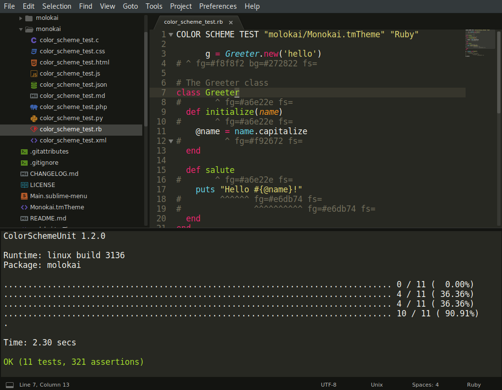

# WHAT COLOR SCHEME UNIT IS

A testing framework for Sublime Text color schemes.

[](https://travis-ci.org/gerardroche/sublime-color-scheme-unit) [](https://coveralls.io/github/gerardroche/sublime-color-scheme-unit?branch=master) [](https://sublimetext.com) [](https://github.com/gerardroche/sublime-color-scheme-unit/tags) [](https://github.com/gerardroche/sublime-color-scheme-unit/stargazers) [](https://packagecontrol.io/packages/ColorSchemeUnit) [](https://twitter.com/gerardroche)

Many color schemes available for Sublime Text are not kept up to date, don't support plugins, use too many variants of the same colors, or only exist to be compatible with a specific theme. They tend to go out of date and break in unexpected and unknown ways. [ColorSchemeUnit](https://github.com/gerardroche/sublime-color-scheme-unit), which is a testing framework for Sublime Text color schemes, helps improve the quality of color schemes and prevent regressions.



## OVERVIEW

* [Installation](#installation)
* [Commands](#commands)
* [Keybindings](#key-bindings)
* [Configuration](#configuration)
* [Writing tests](#writing-tests)
* [Contributing](#contributing)
* [Changelog](#changelog)
* [License](#license)

## INSTALLATION

### Package Control installation

The preferred method of installation is [Package Control](https://packagecontrol.io/browse/authors/gerardroche).

### Manual installation

Close Sublime Text then download or clone this repository to a directory named `ColorSchemeUnit` in the Sublime Text Packages directory for your platform:

* Linux: `git clone https://github.com/gerardroche/sublime-color-scheme-unit.git ~/.config/sublime-text-3/Packages/ColorSchemeUnit`
* OSX: `git clone https://github.com/gerardroche/sublime-color-scheme-unit.git ~/Library/Application\ Support/Sublime\ Text\ 3/Packages/ColorSchemeUnit`
* Windows: `git clone https://github.com/gerardroche/sublime-color-scheme-unit.git %APPDATA%\Sublime/ Text/ 3/Packages/ColorSchemeUnit`

## COMMANDS

Command Palette | Command | Description
--------------- | ------- | -----------
`:TestSuite` | `color_scheme_unit_test_suite` | Run test suite of the current file.
`:TestFile` | `color_scheme_unit_test_file` | Run tests for the current file.
`:TestResults` | `color_scheme_unit_test_results` | Show the test results panel.
`:ShowScopeAndColors` | `color_scheme_unit_show_scope_name_and_styles` | Show the scope name and applied colors of scheme at point under cursor.
`:InsertAssertions` | `color_scheme_unit_insert_assertions` | Inserts assertions for the current line.
`:InsertSyntaxAssertions` | `color_scheme_unit_insert_syntax_assertions` | Inserts syntax assertions for the current line.

*You can also use the [Test](https://github.com/gerardroche/sublime-test) plugin, which unifies ST testing plugin commands.*

## KEY BINDINGS

Add your preferred key bindings:

*The [Test](https://github.com/gerardroche/sublime-test) plugin is highly recommended to unify the test related key bindings.*

`Menu > Preferences > Key Bindings`

```json
[
    { "keys": ["ctrl+shift+a"], "command": "color_scheme_unit_test_suite" },
    { "keys": ["ctrl+shift+f"], "command": "color_scheme_unit_test_file" },
    { "keys": ["ctrl+shift+r"], "command": "color_scheme_unit_test_results" },
    { "keys": ["ctrl+shift+alt+p"], "command": "color_scheme_unit_show_scope_name_and_styles" },
    { "keys": ["ctrl+a"], "command": "color_scheme_unit_insert_assertions" },
    { "keys": ["ctrl+f"], "command": "color_scheme_unit_insert_syntax_assertions" },
]
```

Key bindings provided by default:

Key | Description
--- | -----------
`F4` | Jump to Next Failure
`Shift+F4` | Jump to Previous Failure

## CONFIGURATION

Key | Description | Type | Default
----|-------------|------|--------
`color_scheme_unit.debug` | Enable debug messages. | `boolean` | `false`
`color_scheme_unit.coverage` | Enable coverage report. | `boolean` | `true`

`Menu > Preferences > Settings - User`

```json
{
    "color_scheme_unit.debug": true,
    "color_scheme_unit.coverage": true
}
```

## Writing tests

Color scheme tests are very similar to the sublime text [syntax definition tests](https://www.sublimetext.com/docs/3/syntax.html).

Tests must:

* start with (file name) `color_scheme_test` e.g. `color_scheme_test.php`, `color_scheme_test_shortdesc.php`
* start with (first line) `<comment_token> COLOR SCHEME TEST "<color_scheme>" "<syntax>"`
* be saved within the Packages directory
* use spaces (not tabs)

A suggested layout for your tests:

    .
    ├── MonokaiFree.tmTheme
    └── tests
      ├── color_scheme_test.css
      ├── color_scheme_test.html
      ├── color_scheme_test.js
      ├── color_scheme_test.json
      └── ...

Each test in the syntax test file must first start the comment token (established on the first line, it doesn't have to be a comment according to the syntax), and then a `^` token.

There is one type of test:

Caret: `^` this will test the following selector against the scope on the most recent non-test line. It will test it at the same column the `^` is in. Consecutive `^`'s will test each column against the selector. Assertions are specified after the caret.

There are four types of assertions:


Description | Examples
----------- | --------
Foreground color | `fg=#f8f8f2`
Background color | `bg=#272822`
Font style (space delimited list) | `fs=italic`, `fs=italic bold`
Sublime Text build version (only `>=` constraint is supported) | `build>=3127`

One or more assertions are required, and they **must be specified in the order**: `fg`, `bg`, `fs`, and `build`.

All of the follow are valid assertions:

```
def somefunc(param1='', param2=0):
# ^ fg=#66d9ef
# ^ bg=#272822
# ^ fs=italic
# ^ fg=#66d9ef bg=#272822 fs=italic build>=3127
# ^ fg=#66d9ef bg=#272822 fs=italic bold
# ^ fg=#66d9ef bg=#272822
# ^ fg=#66d9ef fs=italic
# ^ bg=#272822 fs=italic
# ^ fg=#66d9ef fs=italic
```

See the [MonokaiFree](https://github.com/gerardroche/sublime-monokai-free) tests for lots more examples.

**Examples**

```
# COLOR SCHEME TEST "MonokaiFree/MonokaiFree.tmTheme" "Python" # flake8: noqa

import os
# ^ fg=#f8f8f2 bg=#272822 fs=
#  ^^^ fg=#f92672 fs=
#      ^^ fg=#f8f8f2

def f_name(arg1='', arg2=0):
# ^ fg=#66d9ef fs=italic
#   ^^^^^^ fg=#a6e22e fs=
#          ^ fg=#fd971f fs=italic
#              ^ fg=#f92672 fs=
#               ^^ fg=#e6db74 fs=
#                 ^ fg=#f8f8f2 fs=
#                   ^ fg=#fd971f fs=italic
#                       ^ fg=#f92672 fs=
#                        ^ fg=#ae81ff fs=
    if arg1 > arg2: # interesting
    #   ^ fg=#f92672 fs=
    #           ^ fg=#f92672 fs=
        print 'Gre\'ater'
        # ^ fg=#f92672 fs=
        #     ^^^^ fg=#e6db74 fs=
        #         ^^ fg=#ae81ff fs=
        #           ^^^^^ fg=#e6db74 fs=
```

```
<!-- COLOR SCHEME TEST "MonokaiFree/MonokaiFree.tmTheme" "HTML" -->
<!DOCTYPE html>
<!-- ^^^^ fg=#f92672 fs= -->
<!--      ^^^^^ fg=#f8f8f2 fs= -->
<html>
    <head>

        <meta charset="utf-8">
<!--    ^ fg=#f8f8f2 fs= -->
        <!--^ fg=#f92672 fs= -->
        <!--  ^ fg=#a6e22e fs= -->
        <!--         ^ fg=#f8f8f2 fs= -->
        <!--           ^ fg=#e6db74 fs= -->
        <!--                 ^ fg=#f8f8f2 fs= -->
    </head>
    <body>
        <p class="title" id='title'>Title</p>
    <!-- ^ fg=#f92672 fs= -->
        <!-- ^ fg=#a6e22e fs= -->
        <!--    ^ fg=#f8f8f2 fs= -->
        <!--     ^^^^^^^ fg=#e6db74 fs= -->
        <!--             ^^ fg=#a6e22e fs= -->
        <!--               ^ fg=#f8f8f2 fs= -->
        <!--                ^^^^^^^ fg=#e6db74 fs= -->
        <!--                       ^ fg=#f8f8f2 fs= -->
        <!--                               ^ fg=#f92672 fs= -->
        <!--                                ^ fg=#f8f8f2 fs= -->

    </body>
<!--  ^ fg=#f92672 fs= -->
</html>
<!-- ^ fg=#f92672 fs= -->
```

```
<?php // COLOR SCHEME TEST "MonokaiFree/MonokaiFree.tmTheme" "PHP"

use \Psr\Http\Message\ServerRequestInterface as Request;
//^ fg=#f92672 fs=
//  ^^^^^^^^^^^^^^^^^^ fg=#f8f8f2 fs=
//                    ^^^^^^^^^^^^^^^^^^^^^^ fg=#66d9ef fs=italic
//                                           ^^ fg=#f92672 fs=
//                                              ^^^^^^^ fg=#a6e22e fs=
//                                                     ^ fg=#f8f8f2 fs=
use \Psr\Http\Message\ResponseInterface as Response;
//^ fg=#f92672 fs=
//  ^^^^^^^^^^^^^^^^^^ fg=#f8f8f2 fs=
//                    ^^^^^^^^^^^^^^^^^ fg=#66d9ef fs=italic
//                                      ^^ fg=#f92672 fs=
//                                         ^^^^^^^^ fg=#a6e22e fs=
//                                                 ^ fg=#f8f8f2 fs=

require 'vendor/autoload.php';
// ^^^^ fg=#f92672 fs=
//      ^^^^^^^^^^^^^^^^^^^^^ fg=#e6db74 fs=
//                           ^ fg=#f8f8f2 fs=
```

## CONTRIBUTING

Your issue reports and pull requests are always welcome.

## CHANGELOG

See [CHANGELOG.md](CHANGELOG.md).

## LICENSE

Released under the [BSD 3-Clause License](LICENSE).
